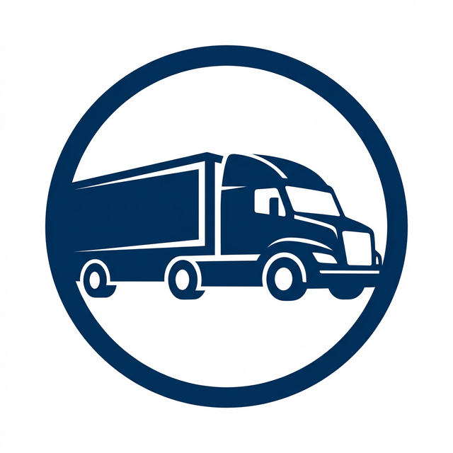

# 🚚 PDS-Transport - Modern Logistics Dashboard

**PDS-Transport** is a premium, feature-rich logistics and transport management dashboard built with **Next.js 16**, **Tailwind CSS v4**, and **TanStack Table**. It's designed for speed, clarity, and ease of use in handling complex transport data.



## ✨ Features

- **📊 Advanced Transport Analytics** - Real-time overview of transport status and metrics.
- **📄 First Report System** - Specialized paginated reports with status filtering and search.
- **📈 Dynamic Data Tables** - Powered by `@tanstack/react-table` with:
  - Row expansion for detailed allocation data.
  - Pipe-separated data parsing and transformation.
  - Sticky headers and responsive layouts.
- **🖨️ Professional PDF Generation** - Instantly generate and download transport TPs and reports using `jspdf` and `jspdf-autotable`.
- **🔐 Unified Authentication** - Secure login and logout flows with a modern UI.
- **⚙️ Master Data Management** - Full management for Owners, Employees, Trucks, Godowns, Schemes, and more.
- **🛣️ DO Card Support** - Integrated DO Generation and Allocation workflows.
- **🌑 Modern UI/UX** - Fully responsive, mobile-friendly design with Dark/Light mode support and custom theme presets.

## 🛠️ Tech Stack

- **Framework**: [Next.js 16](https://nextjs.org/) (App Router)
- **Language**: [TypeScript](https://www.typescriptlang.org/)
- **Styling**: [Tailwind CSS v4](https://tailwindcss.com/), [Radix UI](https://www.radix-ui.com/)
- **Data Fetching**: [TanStack Query v5](https://tanstack.com/query/latest)
- **Table Handling**: [TanStack Table v8](https://tanstack.com/table/latest)
- **State Management**: [Zustand](https://zustand-demo.pmnd.rs/)
- **Verification**: [Zod](https://zod.dev/)
- **Tooling**: [Biome](https://biomejs.dev/) (Formatting & Linting), [Husky](https://typicode.github.io/husky/)

## 📂 Project Structure

This project follows a **colocation-based architecture**. Each feature maintains its own pages, components, and logic within its route folder to ensure scalability and modularity.

```text
src/
├── app/               # Next.js App Router (Routes & Layouts)
├── components/        # Shared UI Components (Radix, Shadcn)
├── hooks/             # Custom React Hooks (Data Fetching, Logic)
├── lib/               # Utility Functions (PDF Utils, Axios Config)
├── navigation/        # Sidebar & Navbar Configuration
├── scripts/           # Custom Theme & Build Scripts
└── stores/            # Zustand State Management
```

## 🚀 Getting Started

### Prerequisites
- Node.js 18+ 
- npm or pnpm

### Installation

1. **Clone the repository**
   ```bash
   git clone https://github.com/aryanbariya/Transport-Dashboard.git
   cd Transport-Dashboard
   ```

2. **Install dependencies**
   ```bash
   npm install
   ```

3. **Environment Setup**
   Create a `.env` file in the root directory and add your backend URL:
   ```env
   NEXT_PUBLIC_API_URL=your_api_url_here
   ```

4. **Start Developing**
   ```bash
   npm run dev
   ```
   Open [http://localhost:3000](http://localhost:3000) to see the dashboard.

## 📦 Build & Deploy

Build the production-ready application:
```bash
npm run build
```

The output will be in the `.next` folder, ready for deployment on Vercel or any Node.js environment.

---

**Built with ❤️ for PDS-Transport**